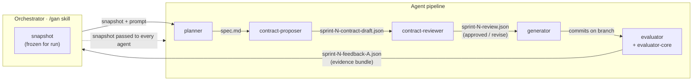
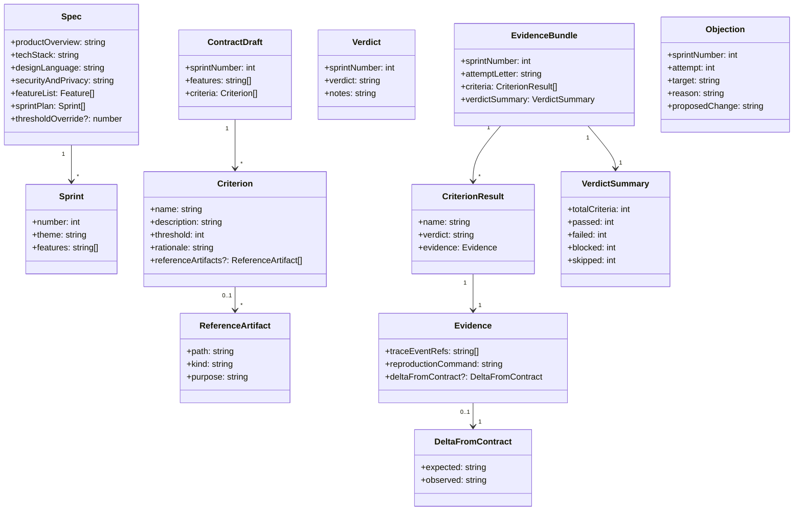
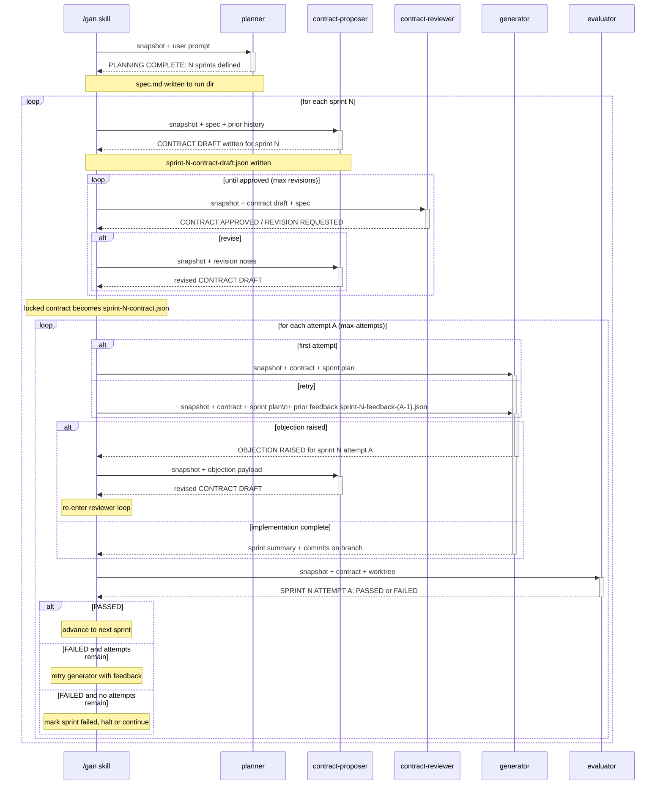
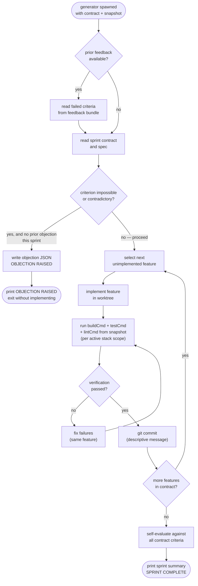
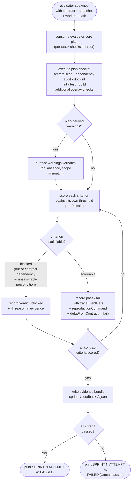

# GAN — Agent Layer

Five specialised LLM agents orchestrated by the `/gan` skill in a fixed pipeline: planner produces a spec, contract-proposer and contract-reviewer establish measurable acceptance criteria, generator implements one feature at a time, and evaluator scores the result against the contract.

---

## 1 — Agent pipeline

---

## 2 — Artefact type model

---

## 3 — Sprint orchestration sequence

---

## 4 — Generator feature loop

---

## 5 — Evaluator scoring flow

