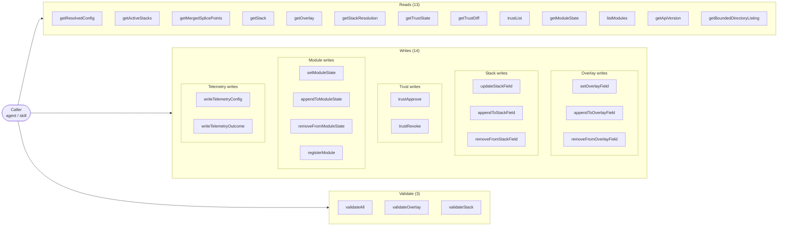
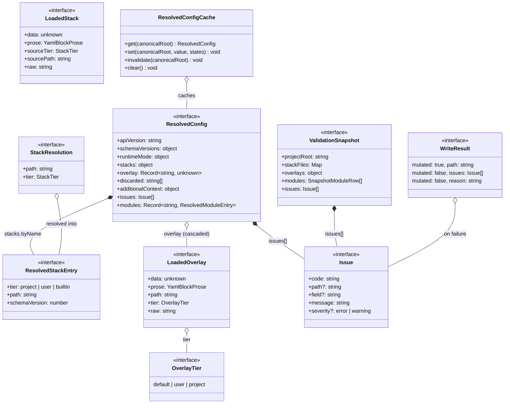
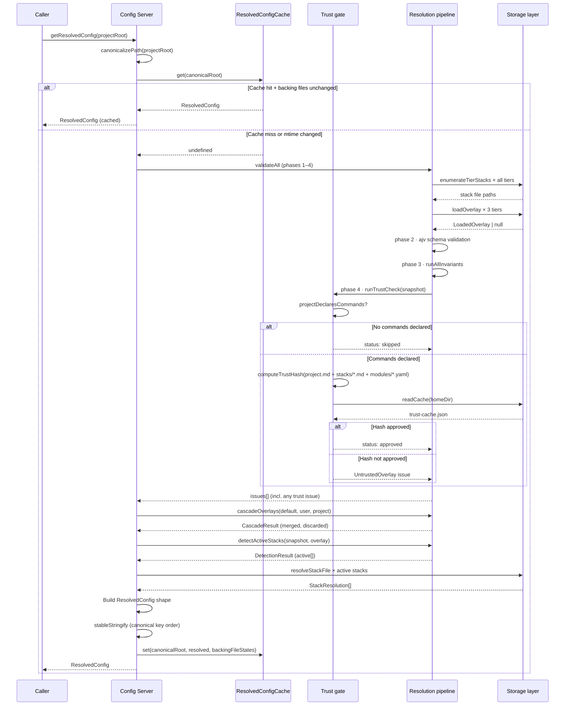
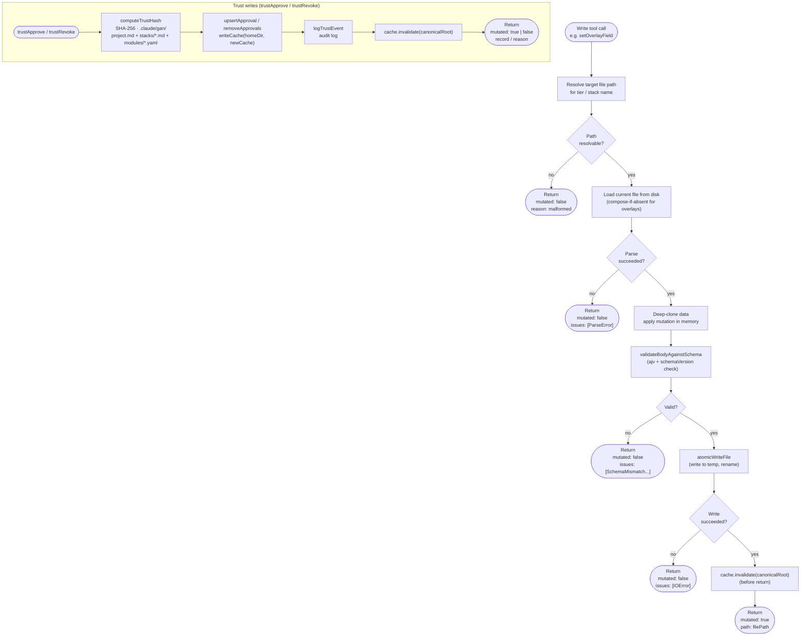

# GAN — Config Server

The sole gateway to all GAN configuration: an MCP server that exposes reads, writes, and validation tools so agents and the /gan skill never read config files directly.

---

## 1 — Tool surface

---

## 2 — Resolution pipeline

```mermaid
flowchart TD
    START(["getResolvedConfig\nprojectRoot"]) --> CANON["Canonicalise\nprojectRoot"]
    CANON --> CACHE_CHECK{"Cache hit?\nmtime guard"}
    CACHE_CHECK -->|"hit"| RETURN_CACHED(["Return cached\nResolvedConfig"])
    CACHE_CHECK -->|"miss"| DETECT

    subgraph PHASE1["Phase 1 — Discovery"]
        DETECT["Enumerate stack files\nall tiers"]
        DETECT --> OVERLAYS["Load overlay tiers\ndefault · user · project"]
        OVERLAYS --> MOD_DISC["Discover modules\nfrom package root"]
    end

    MOD_DISC --> SCHEMA_VAL

    subgraph PHASE2["Phase 2 — Schema validation"]
        SCHEMA_VAL["validateStackBodyAgainstSchema\nvalidateOverlayBodyAgainstSchema\n(ajv, schemaVersion exact-match)"]
    end

    SCHEMA_VAL --> INVARIANTS

    subgraph PHASE3["Phase 3 — Cross-file invariants"]
        INVARIANTS["runAllInvariants\n8 registered invariants"]
    end

    INVARIANTS --> TRUST_GATE

    subgraph PHASE4["Phase 4 — Trust gate (last validation phase)"]
        TRUST_GATE["projectDeclaresCommands?"]
        TRUST_GATE -->|"no commands"| TRUST_SKIP["skipped"]
        TRUST_GATE -->|"GAN_TRUST=unsafe-trust-all"| TRUST_BYPASS["bypassed"]
        TRUST_GATE -->|"commands present"| HASH["computeTrustHash\nSHA-256 · project.md +\nstacks/*.md + modules/*.yaml"]
        HASH --> CACHE_LOOKUP["Lookup in\ntrust-cache.json"]
        CACHE_LOOKUP -->|"approved"| TRUST_OK["approved"]
        CACHE_LOOKUP -->|"no match"| TRUST_ISSUE["UntrustedOverlay\nissue (folded into issues[];\nresolution still proceeds)"]
    end

    TRUST_SKIP --> CASCADE
    TRUST_BYPASS --> CASCADE
    TRUST_OK --> CASCADE
    TRUST_ISSUE --> CASCADE

    subgraph C4["C4 — Overlay cascade"]
        CASCADE["cascadeOverlays\ndefault < user < project"]
        CASCADE --> SPLICE["Per splice-point merge\nlist-union · scalar-override\ndeep-merge-cache-env · merge-role-map"]
        SPLICE --> DISCARD["Record discardInherited\npaths"]
    end

    DISCARD --> STACK_DETECT

    subgraph C2["C2 — Stack detection"]
        STACK_DETECT{"stack.override\nnon-empty?"}
        STACK_DETECT -->|"yes"| EXPLICIT["Use explicit list\nMissingFile on unknown names"]
        STACK_DETECT -->|"no"| AUTO["Auto-detect via\ndetection block globs"]
        AUTO --> FALLBACK["Generic fallback\nif nothing matched"]
    end

    EXPLICIT --> RESOLVE_STACKS
    FALLBACK --> RESOLVE_STACKS

    subgraph C5["C5 — Stack resolution"]
        RESOLVE_STACKS["resolveStackFile per active stack\nproject → user → builtin (pkg) → builtin (fixture)"]
    end

    RESOLVE_STACKS --> BUILD

    subgraph BUILD_SHAPE["Build ResolvedConfig"]
        BUILD["Assemble F2 shape\napiVersion · schemaVersions · runtimeMode\nstacks · overlay · discarded\nadditionalContext · issues · modules"]
        BUILD --> STABLE["Round-trip through\nstableStringify\n(canonical key order)"]
    end

    STABLE --> CACHE_WRITE["Cache.set\nwith backing-file mtime snapshot"]
    CACHE_WRITE --> RETURN(["Return\nResolvedConfig"])
```

---

## 3 — Type model

---

## 4 — getResolvedConfig call sequence

---

## 5 — Write operation flow

