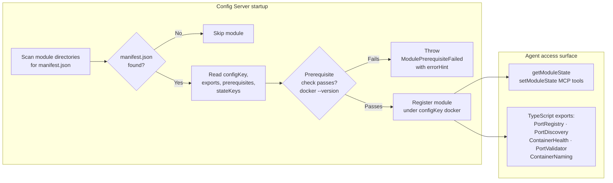
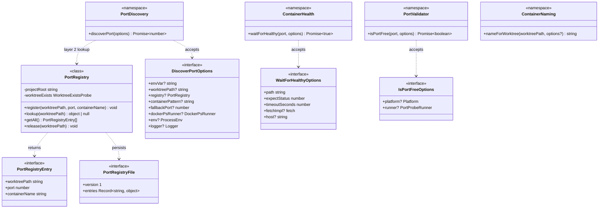
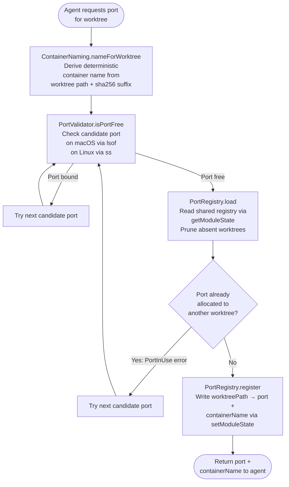
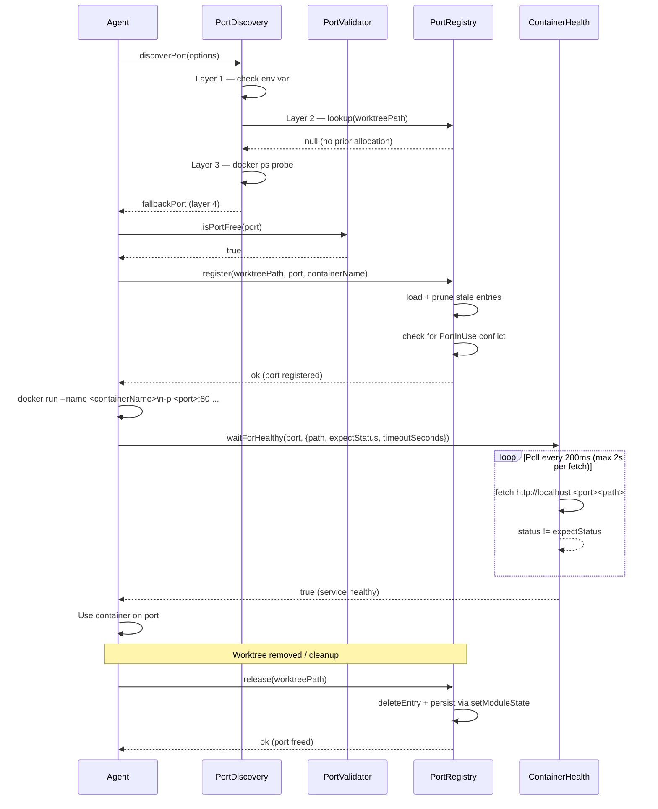

# GAN — Docker Module

An optional GAN module that manages Docker container names and host-port allocation across git worktrees, activated passively by manifest discovery at Config Server startup.

---

## 1 — Module activation

---

## 2 — Type model

---

## 3 — Port allocation flow

---

## 4 — Container lifecycle sequence

