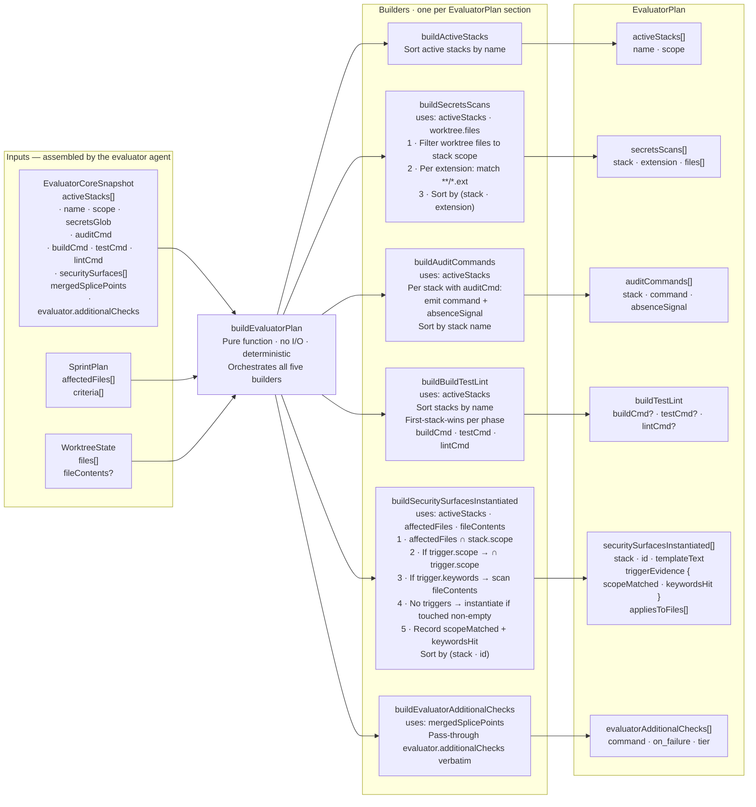
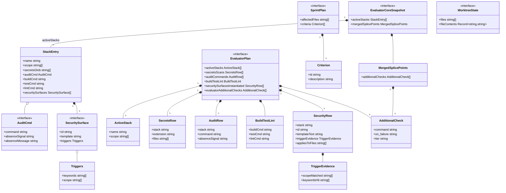
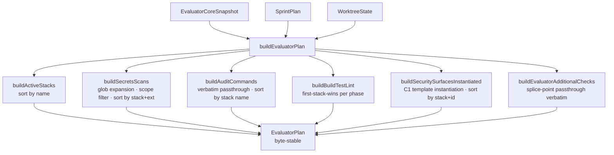
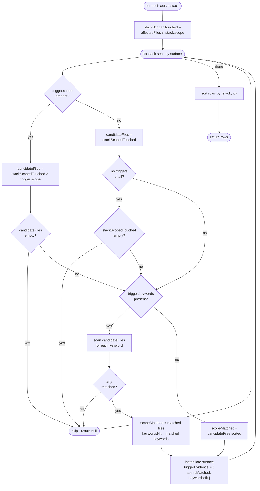
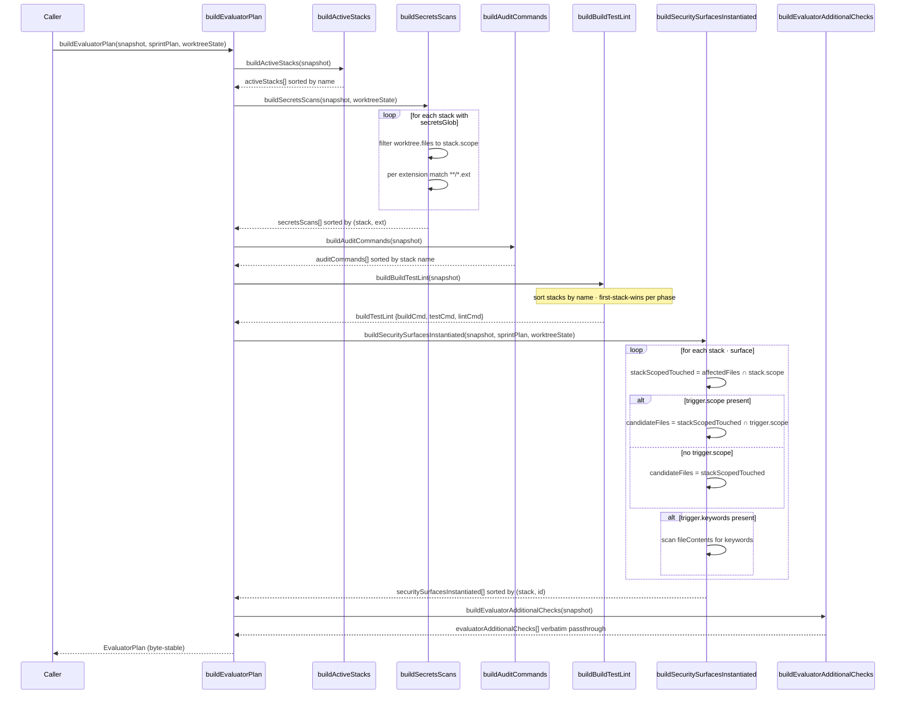

# GAN — Evaluator-core

Technical documentation for the evaluator-core deterministic subsystem.

---

## 1 — Internals overview

---

## 2 — Type model

---

## 3 — Execution flow

---

## 4 — Security surface instantiation algorithm

---

## 5 — Call sequence

