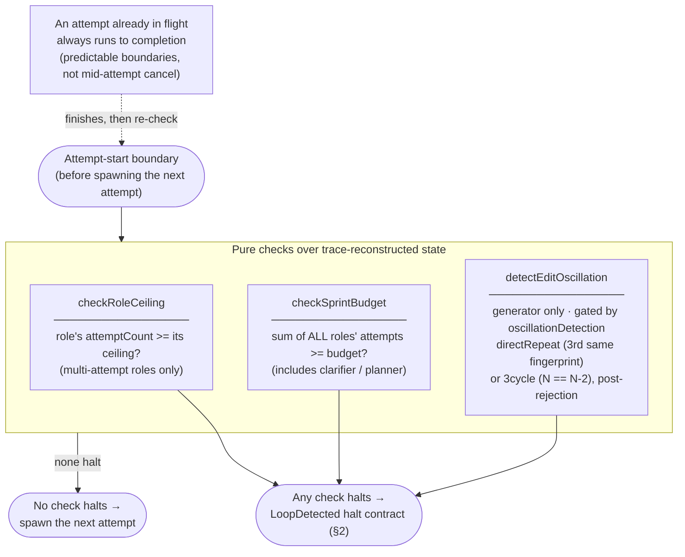
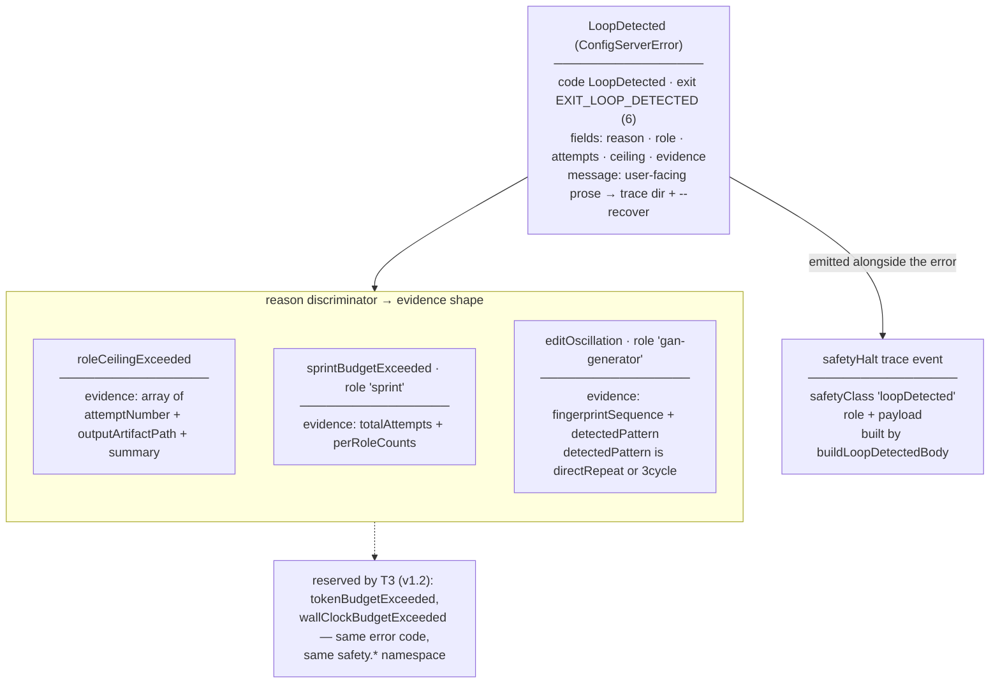
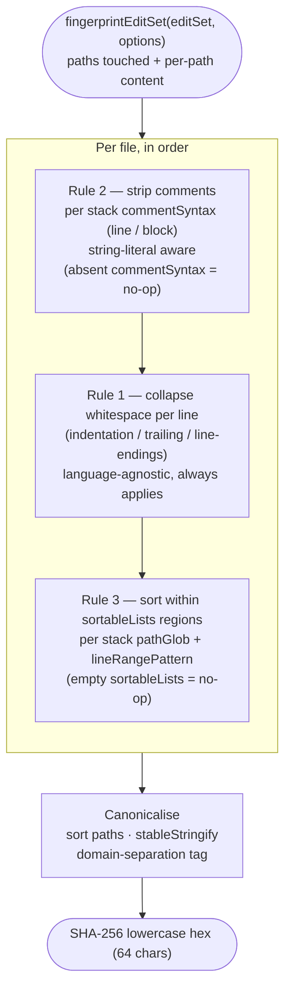
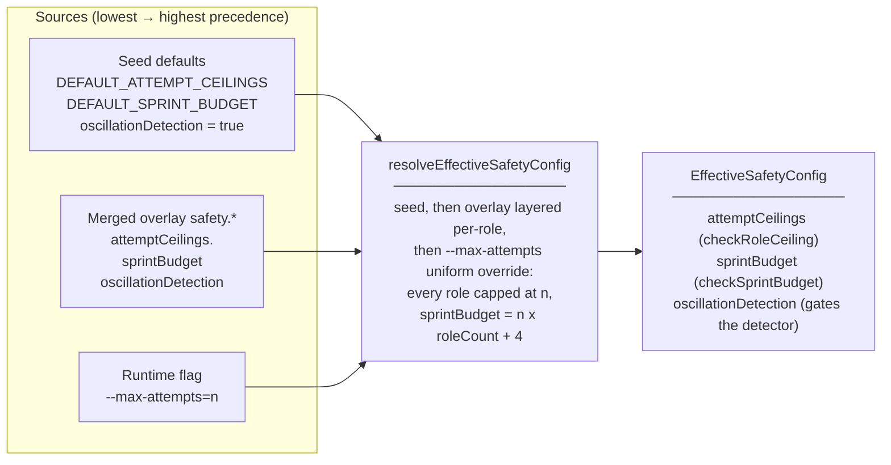
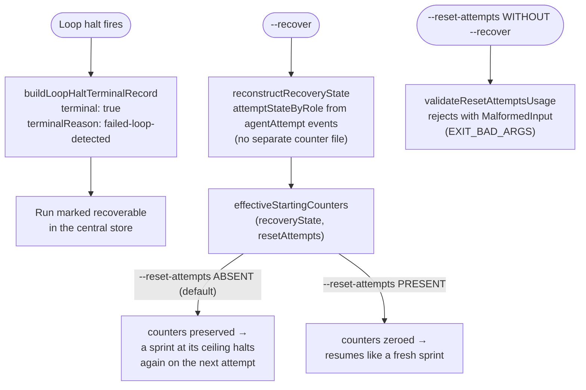

# GAN — Safety (loop & thrash detection)

The Safety subsystem is the framework-owned halt layer (A1). It bounds a `/gan`
run so a sprint that cannot converge halts with a structured error instead of
retrying without limit. Every export under `src/safety/` is a **pure function**
over plain data — the per-role attempt accounting the trace reconstructs, the
merged overlay's `safety.*` block, and the parsed runtime flags — with no I/O
and no persisted state. The orchestrator composes these decisions at
attempt-start boundaries (see `skills/gan/SKILL.md`); this subsystem owns only
the decisions, never the agents' behaviour.

---

## 1 — The three halt triggers (checked at attempt-start)

The three triggers are **independent** — any one halts on its own — and all
share one error code and one trace event (§2). Counters are reconstructed from
the run's `agentAttempt` trace events via `reconstructRecoveryState`; there is
**no separate counter file**, which is what lets `--recover` rebuild the counts
(§5). The seed defaults are `gan-contract-proposer: 3`, `gan-generator: 3`
(per-role) and `12` (sprint-wide); both are documented seed values, not
data-derived, re-tuned by a post-release audit against trace data.

---

## 2 — The `LoopDetected` halt contract

On a halt the orchestrator: (1) builds a `safetyHalt` trace event with
`buildLoopDetectedBody` (`safetyClass = "loopDetected"`) and emits it; (2)
surfaces the `LoopDetected` structured error built by `createLoopDetectedError` /
`createSprintBudgetError` / `createEditOscillationError` — all the **same** error
code, each rendering user-facing prose that points at the run's trace directory
and `--recover`; (3) marks the sprint halted and exits with `EXIT_LOOP_DETECTED`
(6), distinct from the validation/contract classes (2–5) so a caller can tell a
halt apart from a contract failure. The `"sprint"` role on a budget halt is a
sentinel denoting the aggregate, not an agent.

---

## 3 — Edit-fingerprint normalization (what "the same edit" means)

Rule 1 runs **before** rule 3 so the sort key is whitespace-normalized — a
reorder that also carries incidental in-region whitespace differences still
collapses. The normalization is **stack-agnostic in code**: comment markers and
sortable regions come only from the C1 stack fields `commentSyntax` and
`sortableLists` (schema additions that ride with A1); no comment token or
import-block heuristic is hard-coded for any ecosystem. The oscillation detector
(§1) compares attempts by this exact digest rather than re-deriving its own, so
the normalization rules and the triggers cannot drift apart.

---

## 4 — Effective-safety-config resolution

Precedence is **flags > overlay > defaults**. An unspecified role keeps its seed
default (raising one role's ceiling never drops the others). `--max-attempts=n`
is a coarse one-off knob that beats the overlay: it caps every multi-attempt
role at `n` and derives the sprint budget as `n × roleCount + 4` (the `+4` is
fixed headroom for clarifier, planner, reviewer, evaluator). Setting
`safety.oscillationDetection: false` gates off the detector at the **call site**
— a generator that repeats fingerprints then proceeds to its per-role ceiling
without an `editOscillation` halt; the pure detector itself is unchanged (A1
never modifies agent behaviour). All role-keyed maps are built with the
null-prototype / forbidden-key (`__proto__`/`constructor`/`prototype`) discipline
the trace reconciler establishes.

---

## 5 — Recovery and `--reset-attempts`

A halt writes a recoverable terminal record so `--recover` can find and resume
it. Recovery preserves the trace-reconstructed counters **by default** — a silent
reset on resume would defeat the ceiling, so the user must change the prompt (or
raise the ceiling/overlay) for the next attempt to converge differently.
`--reset-attempts` is the explicit, recover-scoped opt-in for fresh counters and
is **valid only alongside `--recover`**; standalone use is a usage error. The
full `--recover` orchestrator flow is O2's later work; this subsystem owns only
the recovery *semantics* (terminal reason, counter resume, the flag guard) as
pure pieces the orchestrator composes.

---

## Key structural principles

- **The trace is the only counter.** Every count the safety layer consults is
  reconstructed from `agentAttempt` events, never a sidecar file — so `--recover`
  rebuilds the exact state the original run had.
- **One halt contract, three triggers.** Per-role ceiling, sprint budget, and
  edit oscillation all emit one `safetyHalt` (`safetyClass = "loopDetected"`) and
  one `LoopDetected` error code with one exit code — no parallel halt paths.
- **Stack-agnostic by construction.** Fingerprint normalization reads comment
  syntax and sortable regions only from the C1 stack fields; nothing is
  hard-coded for an ecosystem.
- **Pure decisions, composed by the orchestrator.** The subsystem never spawns,
  cancels, or modifies an agent; it answers "halt or proceed" at attempt-start
  and the orchestrator acts on the answer.
- **Seed values, not tuned constants.** The default ceilings (3/3) and budget
  (12) are opinionated seeds that err toward halting early; a post-v1.0 audit
  re-tunes them against real trace data. T3 (v1.2) extends the same contract with
  token / wall-clock budget discriminators.
