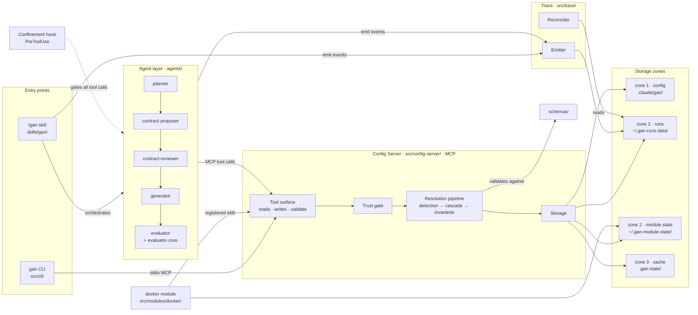
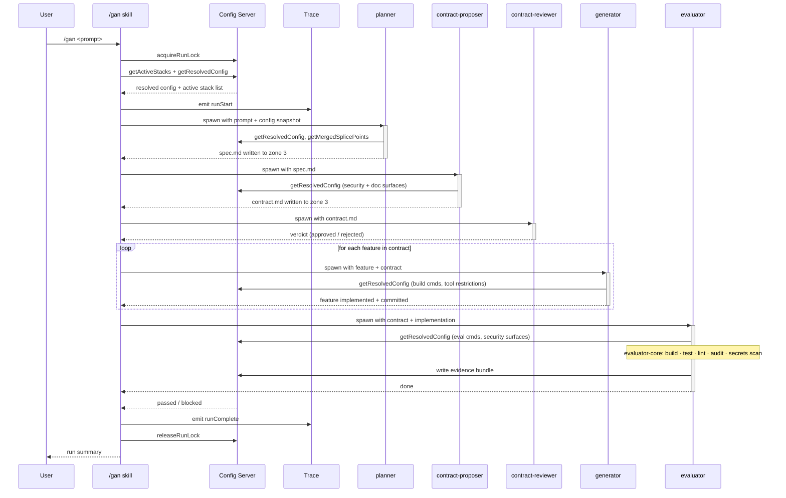
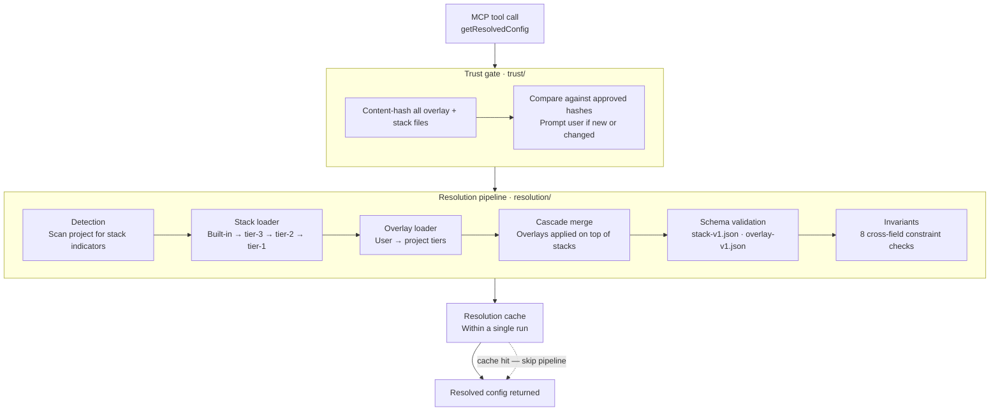
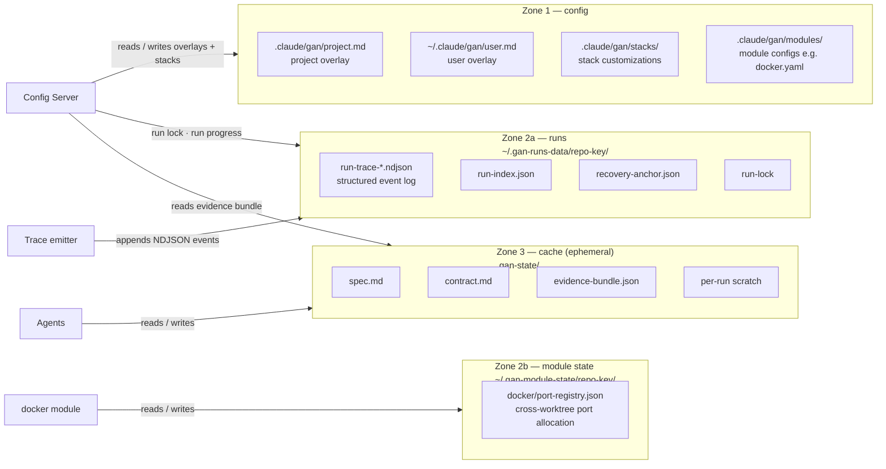
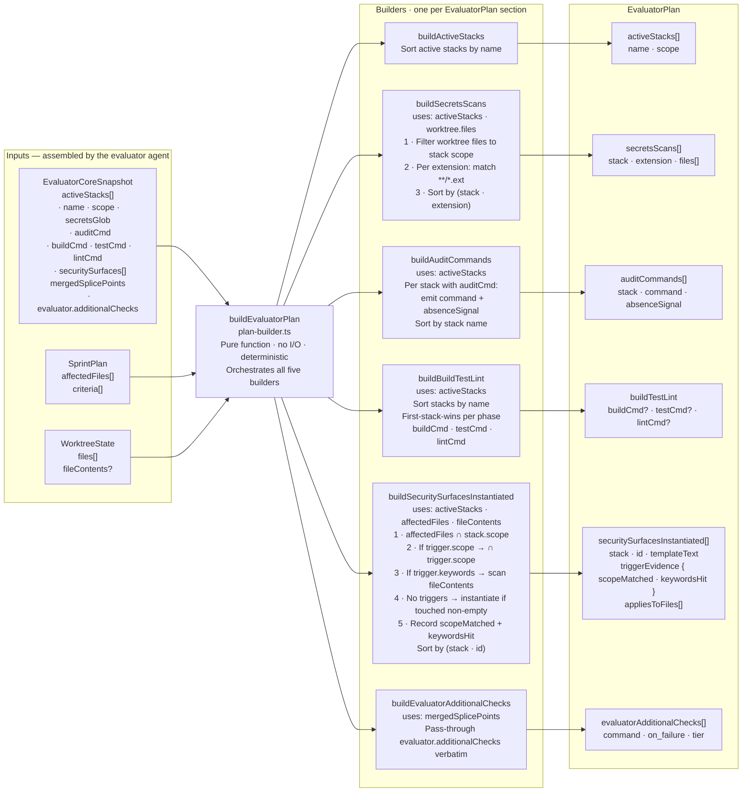

# GAN — Subsystem Architecture

High-level technical documentation showing how the GAN framework subsystems cooperate.

---

## 1 — Component architecture

Left-to-right layout following the natural flow: entry points → agent layer → config server → storage.
Related components are grouped: entry points together, trace below the agents that feed it,
schemas and docker adjacent to the config server they serve.

---

## 2 — /gan run sequence

---

## 3 — Config server resolution pipeline

Called on every `getResolvedConfig` tool invocation.

---

## 4 — Storage topology

What lives where, and what owns each zone.

---

## 5 — Evaluator-core internals

`src/agents/evaluator-core/` is a pure TypeScript library loaded by the evaluator agent.
`buildEvaluatorPlan` is its single entry point — a deterministic, no-I/O function that
produces a byte-stable `EvaluatorPlan` for the same inputs regardless of call order or process.

---

## Key structural principles

- **Config Server is the sole gateway to zone 1 and zone 2.** Agents and the skill never read config files or run-state directly — they call MCP tools.
- **Zone 3 is the only shared scratch space agents write to directly.** It is ephemeral; nothing in zone 3 survives worktree removal.
- **The trace emitter is the only writer to the zone-2 run log.** The reconciler is the only reader outside the normal flow.
- **Trust gate runs before every resolution.** No resolved config is served from an unapproved file hash.
