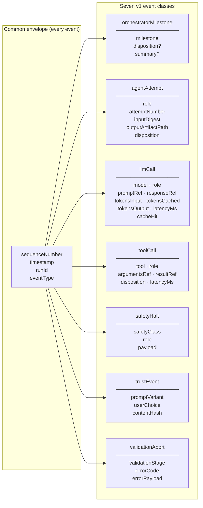
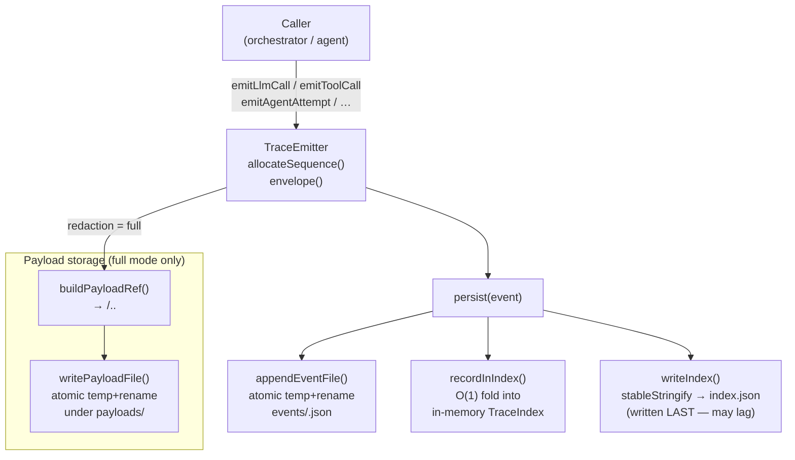
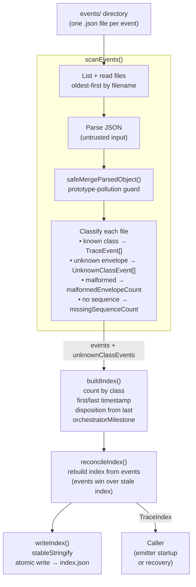
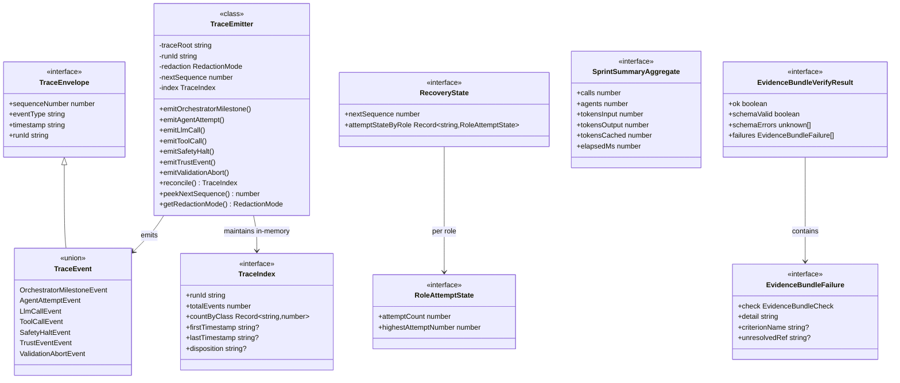
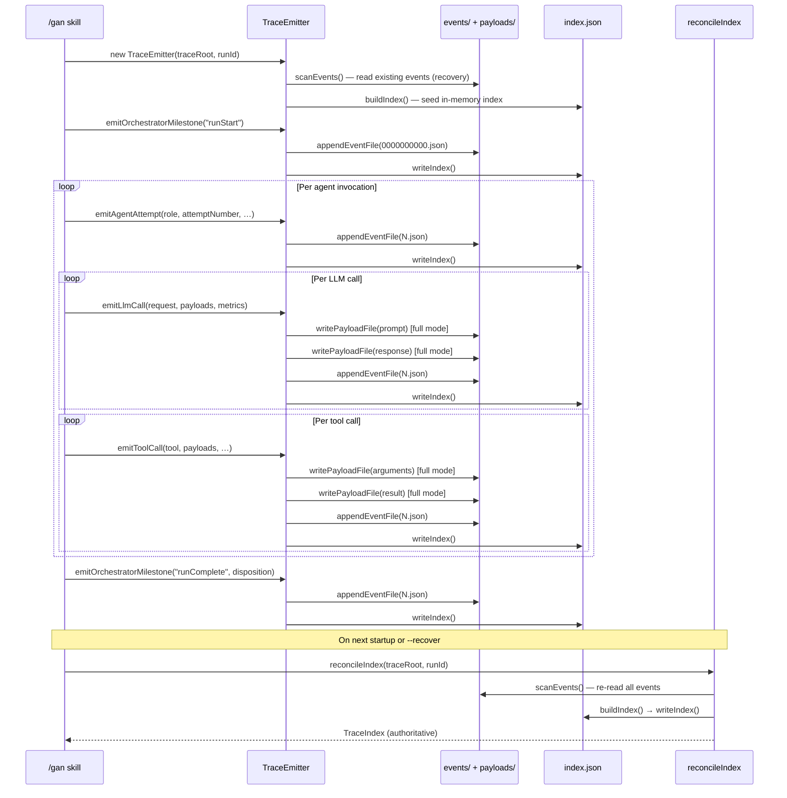

# GAN — Trace

The Trace subsystem is the run-observation layer: `TraceEmitter` appends typed NDJSON events to an append-only per-run log, and the reconciler rebuilds a derivative index from those events for recovery and reporting.

---

## 1 — Event taxonomy

---

## 2 — Emission flow

---

## 3 — Index and reconciliation

---

## 4 — Type model

---

## 5 — Run lifecycle sequence

